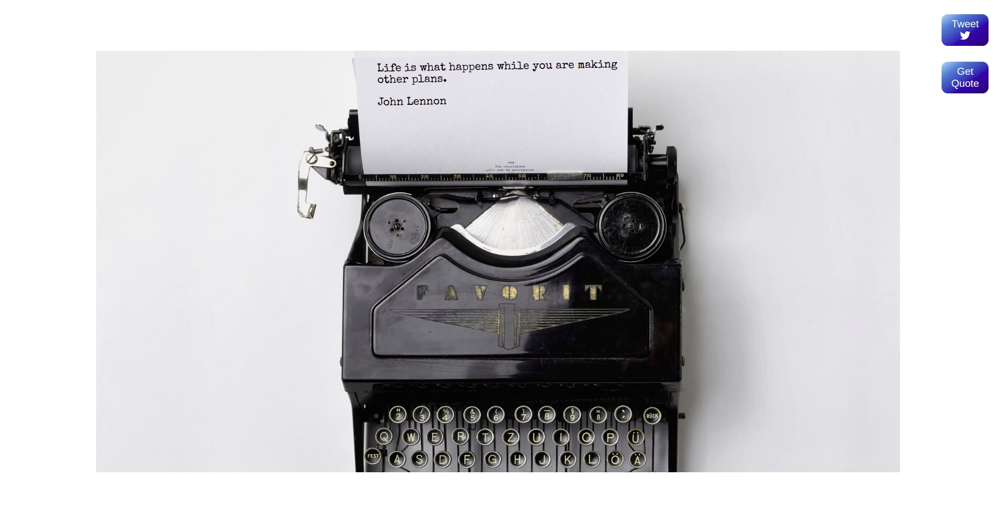

## Random Quote

This project was created to practice Media queries.
Get a random quote and tweet it on twitter.

**Build with:**

&nbsp;

&nbsp;

&nbsp;

&nbsp;

&nbsp;

&nbsp;

[Live Demo](https://mandyneumeyer.github.io/random_quote/)

